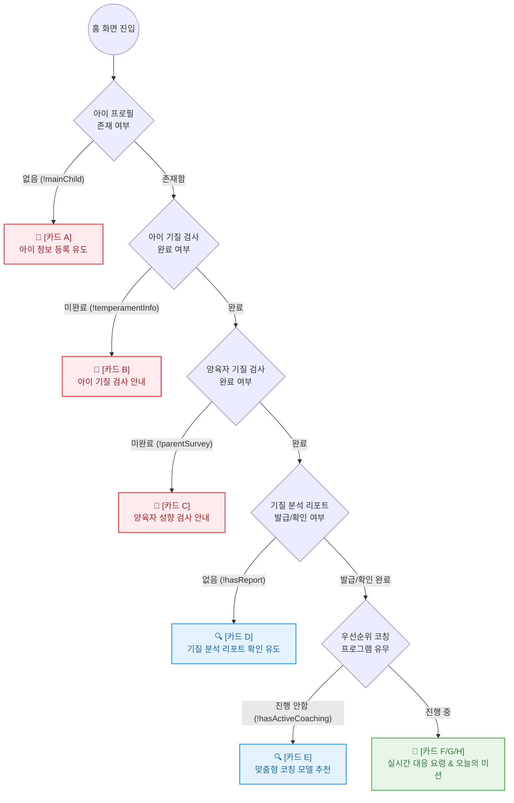

# 홈 화면 다이나믹 액션 카드 (Dynamic Action Card) 조건별 스펙

홈 화면의 프로필 영역 하단에 노출되는 '다이나믹 액션 카드'는 사용자의 현재 상태(데이터 입력 여부, 검사진행도, 코칭 프로그램 참여 여부 등)에 따라 가장 적합한 다음 행동(Next Action)을 단일 혹은 복합적으로 유도하는 반응형 UI 컴포넌트입니다.

## 1. 상태 노출 우선순위 상태 머신 (State Machine)

우선순위가 높은 조건(1순위 온보딩)부터 순차적으로 판별하며, 하위 카드 노출 여부를 평가하는 구조(폭포수 방식)입니다.

## 2. 상태별 노출 우선순위 및 카드 세부 종류

액션 카드는 다음과 같은 라이프사이클(우선순위) 흐름에 따라 결정되며, 상위 필수 조건에 해당할 경우 하위 카드를 덮기 위해 단일 카드로 최상단에 배치됩니다.

### 🔴 1순위: 프라이머리 온보딩 (결측 데이터 입력)
앱의 서비스 사이클을 돌리기 위한 필수 데이터가 누락된 경우 노출됩니다. 가장 강력한 시각적 유도를 띄게 됩니다.

| 종류 | 조건 (Condition) | UI 표시 내용 및 CTA 액션 |
| :--- | :--- | :--- |
| **[카드 A] 아이 정보 등록** | 등록된 아이 프로필(`children.length === 0`)이 없는 경우 | "아이 정보를 등록하고 맞춤형 분석을 시작하세요." $\rightarrow$ `[아이 프로필 등록하기]` |
| **[카드 B] 아이 기질 검사 유도** | 아이 프로필은 존재하나, 아이 대상 기질 검사(BARS) 결과가 없는 경우 | "아이의 타고난 기질을 정확히 파악할 시간이에요." $\rightarrow$ `[아이 기질 검사 시작]` |
| **[카드 C] 양육자 성향 검사 유도** | 아이 검사는 마쳤으나, 사용자(부모)의 기질/양육 방식 검사가 완료되지 않은 경우 | "완벽한 분석을 위해 부모님의 양육 성향도 알려주세요." $\rightarrow$ `[나의 양육 성향 검사 시작]` |

---

### 🟡 2순위: 결과 리포트 및 솔루션 진입 (가이드 단계)
기초 검사가 완료된 후, 그 결과를 리뷰하고 본격적인 코칭 스케줄에 진입하도록 안내하는 단계입니다.

| 종류 | 조건 (Condition) | UI 표시 내용 및 CTA 액션 |
| :--- | :--- | :--- |
| **[카드 D] 기질 분석 리포트 확인** | 모든 필수 검사는 완료되었으나, 최초 심층 리포트를 확인하지 않았거나 신규 리포트가 발급된 직후 | "우리아이 기질 분석이 완료되었어요! 결과를 확인해보세요." $\rightarrow$ `[기질 분석 결과 보기]` |
| **[카드 E] 맞춤형 코칭 프로그램 제안** | 리포트를 확인한 상태이며, 현재 등록/진행 중인 '코칭 프로그램'이 없는(Idle) 상태 | "현재의 고민을 해결해줄 맞춤형 데일리 코칭을 시작해보세요." $\rightarrow$ `[추천 코칭 살펴보기]` |

---

### 🟢 3순위: 데일리 루틴 (서비스 진행 단계)
사용자가 성공적으로 코칭 프로그램에 참여하여 매일 앱을 켜서 확인해야 하는 '일상(Daily) 상태'입니다. (현재 UI에 샘플로 디자인되어 있는 카드들입니다.)
이 단계에서는 여러 개의 카드가 리스트 형태로 겹쳐서 노출될 수 있습니다.

| 종류 | 조건 (Condition) | UI 표시 내용 및 CTA 액션 |
| :--- | :--- | :--- |
| **[카드 F] 실시간 코칭 (이어하기)** | 사용자가 진입한 특정 코칭 세션(예: 떼쓰기 대응법 등)의 중간 단계에 머무른 상태 | 진척율 프로그레스 바(Progress Bar) 정보 포함. "떼쓰기 상황 데이터 기반 대응법" $\rightarrow$ `[이어하기]` |
| **[카드 G] 오늘의 미션 (마법문장)** | 오늘 수행해야 할 데일리 코칭 미션이 할당되어 있고, 아직 미수행 상태인 경우 | 부족한 키워드, 아이에게 건넬 오늘의 마법 문장, 권장 소요시간 배지 포함. $\rightarrow$ `[미션 시작하기]` / `[완료 체크]` |
| **[카드 H] 성과 기록 및 칭찬** | 당일 미션을 모두 수행 완료한 상태 | "오늘도 훌륭하게 미션을 해내셨어요!" (성취감 부여 배지 획득 이펙트 등) $\rightarrow$ `[오늘의 기록 남기기]` |

---

## 2. UI/UX 디자인 정책 (Policy)

1. **상호 배타적 노출 (Mutual Exclusivity)**
   - 1순위(온보딩) 및 2순위(리포트/제안) 카드들은 화면의 1순위 인텐트를 방해하지 않기 위해 원칙적으로 **한 번에 한 가지 카드만 노출**됩니다. 
   - 즉, 아이 등록 카드가 떠있는 상태에서 투뎁스 뒤의 오늘의 미션 카드가 함께 노출되지 않습니다.
2. **수직 나열 노출 (Stacking)**
   - 사용자가 3순위(데일리 루틴) 상태에 진입하면, F와 G 카드처럼 하루에 처리해야 하는 카드들이 여러 개일 경우 위아래로 쌓여(Stack) 구성됩니다.
3. **빈 상태 처리 (Empty State)**
   - 만약 데일리 미션을 모두 마쳤고 이어할 세션도 없는 깨끗한 상태라면, 내일의 미션을 예고하거나 과거 코칭 내역을 복습할 수 있는 [카드 H] 상태 등을 보여주어 화면이 휑하게 보이지 않도록 유지합니다.
