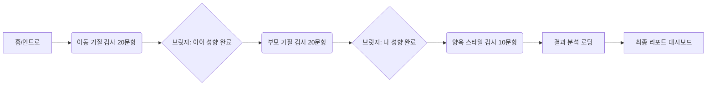

# 기질 및 양육 성향 검사 화면 UI 스펙

## 1. UX Flow 설계

전체 검사 과정은 **[인트로] -> [아동 기질 검사] -> [부모 기질 검사] -> [양육 스타일 검사] -> [최종 리포트]** 순서로 진행됩니다.
사용자의 피로도를 고려하여 각 단계 사이에 **[브릿지 페이지]**를 배치하여 환기 효과를 줍니다.

---

## 2. 화면별 상세 스펙

### 2.1 인트로 (Intro)

*   **목적**: 검사의 필요성을 알리고 시작 버튼을 누르게 유도
*   **UI 요소**:
    *   **메인 카피**: "우리 아이, 도대체 왜 그럴까요?" / "기질을 알면 육아가 쉬워집니다."
    *   **서브 카피**: "3분 만에 아이의 기질과 나의 양육 태도를 점검해보세요."
    *   **일러스트**: 부모와 아이가 웃으며 마주 보는 따뜻한 그림 (Lottie 애니메이션 권장)
    *   **CTA 버튼**: [지금 바로 시작하기] (Floating Action Button)
*   **인터랙션**: 스크롤 시 '기질이 중요한 3가지 이유' 섹션이 페이드인.

### 2.2 검사 진행 화면 (Survey Interface)

모든 검사 단계(아동/부모/양육)에서 공통으로 사용되는 레이아웃입니다.

#### 레이아웃 구조 (Mobile First)
*   **헤더 (Top Navigation)**
    *   [< 뒤로가기] 아이콘
    *   **진행률 표시줄 (Progress Bar)**: 전체 문항 중 현재 위치 표시 (예: 5/20). 부드러운 애니메이션 적용.
*   **질문 카드 (Question Card)**
    *   중앙 정렬, 큰 폰트 (20px 이상)
    *   가독성을 위해 한 화면에 **한 문항씩** 노출 (One Question per Screen)
*   **응답 영역 (Response Area)**
    *   5점 리커트 척도 버튼 (가로 배치)
    *   [전혀 아님] (1) ... (3) ... [매우 그렇다] (5)
    *   터치 시 즉시 다음 문항으로 자동 스크롤/전환
*   **하단 액션**
    *   [이전] 버튼: 실수로 잘못 눌렀을 때 되돌아가기 위함.

#### 단계별 차별화 요소
*   **아동 기질 검사**: 테마 컬러 **Soft Yellow** (#FFD700 계열)
*   **부모 기질 검사**: 테마 컬러 **Calm Blue** (#4A90E2 계열)
*   **양육 스타일 검사**: 테마 컬러 **Sage Green** (#8BC34A 계열)

### 2.3 브릿지 페이지 (Bridge Page)

검사 모듈 간 전환 시 나타나는 중간 페이지입니다.

*   **UI 구성**:
    *   **완료 메시지**: "○○이의 기질 파악이 완료되었어요!"
    *   **다음 단계 안내**: "이제 ○○님 본인의 성향을 알아볼 차례입니다."
    *   **휴식 팁**: "잠시 숨을 고르고, 편안한 마음으로 임해주세요."
    *   **CTA 버튼**: [계속하기] (3초 후 자동 활성화)

### 2.4 결과 분석 로딩 (Analyzing)

*   **UI 구성**:
    *   중앙 로딩 애니메이션 (DNA 나선 구조가 맞춰지는 듯한 모션)
    *   **진행 멘트 롤링**:
        *   "아이의 기질 데이터를 분석 중입니다..."
        *   "부모님의 양육 스타일과 매칭하고 있습니다..."
        *   "맞춤형 양육 솔루션을 생성 중입니다..."

### 2.5 최종 리포트 대시보드 (Result Report)

검사 결과를 한눈에 보여주는 핵심 화면입니다.

#### A. 종합 요약 (Hero Section)
*   **기질 아키타입 태그**: 예) `#호기심대장` `#에너지뿜뿜`
*   **한 줄 요약**: "○○이는 호기심이 많고 에너지가 넘치는 '열정 탐험가' 유형입니다."
*   **캐릭터 이미지**: 해당 기질을 대표하는 동물 캐릭터 표시.

#### B. 기질 프로파일 (Radar Chart)
*   **도표**: 방사형 차트 (Radar Chart)
    *   축: 자극 추구(NS), 위험 회피(HA), 사회적 민감성(RD), 지속성(P)
    *   **데이터 오버레이**: 아이 점수(실선) vs 부모 점수(점선) 비교 시각화
    *   차이(Gap)가 큰 영역은 붉은색 틴트로 강조 (잠재적 갈등 구간)

#### C. 부모-자녀 적합도 (BCI Score)
*   **점수 게이지 바**: 0 ~ 100점
*   **적합도 레벨**: [안정적 조화] / [노력 필요] / [갈등 주의]
*   **해석 코멘트**: "서로 다른 기질이지만, 부모님의 '공감 능력'이 갈등을 잘 중재하고 계시네요."

#### D. 양육 스타일 점검 (Bar Chart)
*   양육 효능감, 자율성 지지, 정서적 반응성 3가지 지표의 막대 그래프.
*   평균 대비 나의 위치 표시.

#### E. 맞춤 솔루션 카드 (Action Plan)
*   **카드 UI**: 탭 가능한 카드 리스트
    1.  **[대화법]**: "아이가 떼쓸 때 이렇게 말해보세요."
    2.  **[놀이법]**: "에너지 발산을 위한 10분 신체 놀이"
    3.  **[마인드셋]**: "부모님을 위한 오늘의 한 마디"

---

## 3. 디자인 시스템 가이드

*   **Typography**: 가독성이 높은 고딕 계열 (Pretendard 권장)
*   **Color Palette**:
    *   Primary: #6C5CE7 (신뢰, 지혜)
    *   Secondary: #FF7675 (따뜻함, 사랑)
    *   Background: #F9F9F9 (편안함)
*   **Component**: 모든 버튼과 카드는 둥근 모서리 (Rounded-lg, 12px) 적용. 부드러운 그림자(Soft Shadow)로 뎁스감 표현.
